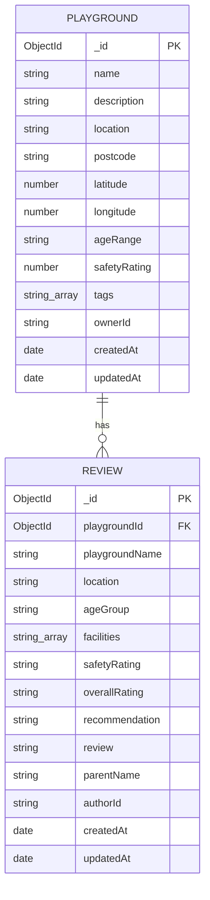

# SpielSpot Backend

Backend API for the SpielSpot playground discovery platform. The frontend reuses the existing SpielSpot project under `frontend/`, and this backend provides CRUD APIs for two related entities, Playground and Review, with Clerk authentication.

Full API plan and ERD: [`docs/api-plan.md`](./docs/api-plan.md). Development log: [`docs/day1-log.md`](./docs/day1-log.md).

## Tech Stack

- Node.js + Express
- MongoDB Atlas + Mongoose
- Clerk (JWT authentication)
- Zod (input validation)
- helmet / cors / express-rate-limit (security middleware)

## Installation

```bash
cd backend
npm install
```

## Environment Variables

Create a `.env` file in the `backend/` root:

```
MONGODB_URI=mongodb+srv://<username>:<password>@cluster0.xxxxx.mongodb.net/spielspot?retryWrites=true&w=majority
PORT=5000
CLERK_SECRET_KEY=sk_test_xxxxx
CLERK_PUBLISHABLE_KEY=pk_test_xxxxx
```

- `MONGODB_URI`: MongoDB Atlas connection string
- `CLERK_SECRET_KEY` / `CLERK_PUBLISHABLE_KEY`: must belong to the same Clerk application as the frontend's `VITE_CLERK_PUBLISHABLE_KEY`

## Running the Server

```bash
npm start
```

A successful start prints:

```
MongoDB connected
Server running on port 5000
```

## API Endpoints

| Method | Endpoint                     | Description                      | Auth            |
| ------ | ---------------------------- | -------------------------------- | --------------- |
| GET    | /api/playgrounds             | Get all playgrounds              | No              |
| GET    | /api/playgrounds/:id         | Get a single playground          | No              |
| POST   | /api/playgrounds             | Create a playground              | Yes             |
| PATCH  | /api/playgrounds/:id         | Update (owner only)              | Yes + ownership |
| DELETE | /api/playgrounds/:id         | Delete (owner only)              | Yes + ownership |
| GET    | /api/playgrounds/:id/reviews | Get all reviews for a playground | No              |
| POST   | /api/playgrounds/:id/reviews | Create a review                  | Yes             |
| DELETE | /api/reviews/:id             | Delete own review                | Yes + ownership |

Full request/response formats is in [`docs/api-plan.md`](./docs/api-plan.md).

## ERD

> GitHub automatically renders the Mermaid syntax below as a diagram, so no separate image file is needed



Relationship: `Playground 1 --- N Review` (Review stores `playgroundId` as a foreign key)

## Security

- Clerk JWT authentication (`requireLogin` middleware)
- Ownership checks: only the resource owner can PATCH/DELETE
- Input validation with Zod
- `helmet`, `cors` (whitelisted frontend origin), `express-rate-limit`
- Centralized error handler that never leaks internal stack traces
- Secrets stored in `.env`, excluded via `.gitignore`

## Current Status

- Done: Playground/Review CRUD, Clerk auth, ownership checks, and security middleware are implemented and tested via Postman
- Not done: the frontend still uses fixture data and is not yet connected to this API
