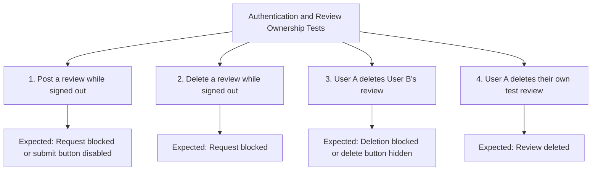

# 2026/10/05｜Review ownership and persistence checks

Project: SpielSpot-v2. This record uses today's chat confirmations and the saved backend handoff notes.

## Tasks Completed

- Completed scenario 4: a signed-in user can delete their own test review. The user confirmed completion; the chat does not include the deletion response or status code.
- Submitted a new review named `TEST - persistence` through the live website.
- Refreshed the Alaunpark detail page and confirmed the review remained visible.
- Added the live review persistence check to `docs/backend-handoff.md`.
- Committed and pushed the documentation to the SpielSpot-v2 `main` branch: `db0d758`.
- Prepared the four authentication and review ownership scenarios as an English Markdown table and Mermaid flowchart.

## Verification Details

- Frontend: https://spielspot.netlify.app
- Backend: https://spielspot.onrender.com
- Playground ID: `6ab30f098ae8fbfd4d48c945`
- Persistence review text: `TEST - persistence check (2026-10-05). I am checking whether this review remains after refreshing the page. All ratings and selections are test values, not feedback from a real visit.`
- The user confirmed that the review appeared after submission and remained visible after refreshing the page.
- The user's push output confirmed `9f3eef2..db0d758 main -> main`.

## Authentication and Review Ownership Test Scenarios

The table and diagram describe the test scenarios and expected results; they do not mark all four tests as passed.

| #   | Test Scenario                          | How to Test                                                    | Expected Result                                         |
| --- | -------------------------------------- | -------------------------------------------------------------- | ------------------------------------------------------- |
| 1   | Signed-out users cannot post reviews   | Sign out, write a review on the live site, and submit it       | Request blocked, error shown, or submit button disabled |
| 2   | Signed-out users cannot delete reviews | Sign out and try to delete an existing review                  | Request blocked                                         |
| 3   | User A cannot delete User B's review   | Sign in as User A and try to delete a review written by User B | Deletion blocked, error shown, or delete button hidden  |
| 4   | User A can delete their own review     | Sign in as User A and delete a test review they wrote          | Review deleted                                          |

## Remaining Checks

- Record response status codes and before/after API results for the ownership scenarios.
- Check whether the review remains after a backend restart or redeployment. Today's page refresh check does not cover this.
- No new automated test results were supplied for this session.

hier ist mein Tagesbericht (5. Okt.):

## Tasks completed today

- Added Jest integration tests for the review creation flow (missing fields, nonexistent playground), and discovered that `createReview` never checked whether the target playground actually existed, so I fixed the controller to return 404 for a missing playground before creating a review.
- Manually verified on the live site that unauthenticated users cannot post a review (blocked client-side before any request is sent) and cannot delete a review (tested via Postman, correctly returns 401).
- Verified cross-user ownership protection with two accounts: User A attempting to delete User B's review correctly returns 403 "Not allowed to delete this review".

## Biggest lesson learned

- Writing the "playground does not exist" test case surfaced a real gap in the backend: anyone could create a review attached to a nonexistent playground, since `createReview` only used the ID from the URL without verifying it first. This was a good reminder that integration tests aren't just about confirming expected behavior, they can also expose logic that was never actually checked.
