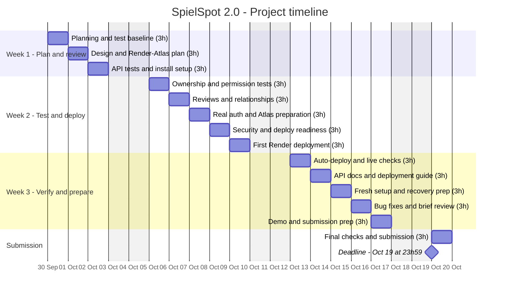

# SpielSpot 2.0 | Project timeline

> **September 30 – October 19, 2026 · 14 working days · 3 hours per day · 42 hours total**

Project: [SpielSpot-v2](https://github.com/i-chieh-liu-88/SpielSpot-v2)

Deployment reference: [Backend-Deployment blueprint](https://github.com/i-chieh-liu-88/Backend-Deployment/blob/main/deployment-blueprint.md) and [pre-deployment checklist](https://github.com/i-chieh-liu-88/Backend-Deployment/blob/main/pre-deployment-checklist.md).

**Planned stack: Render + MongoDB Atlas + Clerk.** Preparation starts in week 1, the first deployment is targeted for October 9, and automatic deployment and live workflows are verified on October 12.

## Daily timeline

Each bar marks a scheduled working date, not eight or twenty-four hours of work. Each day has three tasks totaling three hours. Weekends are excluded from work; their dates remain visible on the calendar axis. All bars represent planned work, not verified completion.

The deadline diamond marks the submission date. The exact deadline is **October 19, 2026, at 23:59 (Europe/Berlin)**. Submit during the day and keep the final hour for unexpected issues.

## Workload by phase

| Phase | Working days | Planned effort |
| --- | ---: | ---: |
| Plan and review · Sep 30 – Oct 2 | 3 | 9 hours |
| Test and deploy · Oct 5–9 | 5 | 15 hours |
| Verify and prepare · Oct 12–16 | 5 | 15 hours |
| Submission · Oct 19 | 1 | 3 hours |
| **Total** | **14** | **42 hours** |

## Daily task details

See the [English daily checklist](SpielSpot-v2-timetable-EN.md) for all 42 tasks, time estimates, and daily goals, or the [Chinese daily checklist](SpielSpot-v2-timetable.md).

Most days use **60 + 60 + 60 minutes**. October 7 uses **45 + 60 + 75 minutes** for authentication, persistence, and Atlas preparation; October 9 uses **45 + 90 + 45 minutes** for deployment.

## Deployment milestones

| Target | Required evidence |
| --- | --- |
| Oct 2 | Verified backend dependency layout, installation/start commands, and Render Root Directory |
| Oct 8 | Atlas preparation, safe error handling, secrets review, and tested health/startup checks |
| Oct 9 | Render HTTPS URL, deployed commit, and authenticated write/read verified in Atlas |
| Oct 12 | Automatic deployment verified; original data survives redeployment; live permissions and frontend flow checked |
| Oct 14 | Deployment guide, fresh setup results, and recovery/export notes |

These are targets, not completion claims. If the initial deployment slips, use October 12 for deployment fixes before adjusting later documentation and demo work. Total planned effort remains 42 hours, with no weekend work.

Mermaid's Gantt format supports sections, date-based bars, weekend exclusions, and milestones. See the [Mermaid Gantt documentation](https://mermaid.js.org/syntax/gantt.html).
