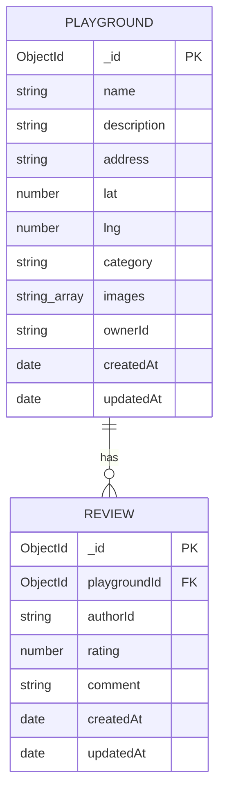

# SpielSpot-v2 Backend API Plan

Mini project 規劃文件。前端沿用 `i-chieh-liu-88/SpielSpot-v2` 的 `frontend/`，本文件規劃全新的 `backend/`。

## Tech Stack

- Runtime: Node.js + Express
- Database: MongoDB Atlas + Mongoose
- Auth: Clerk（驗證前端傳來的 JWT）

## ERD

> GitHub 會自動渲染下面的 Mermaid 語法成圖，不需要額外的圖片檔



關係：`Playground 1 --- N Review`（Review 用 `playgroundId` 存外鍵）

## API Endpoints

| Method | Endpoint | 說明 | 需要驗證？ |
|---|---|---|---|
| GET | /api/playgrounds | 取得所有 playground（可加 query filter） | 否 |
| GET | /api/playgrounds/:id | 取得單一 playground＋其 reviews | 否 |
| POST | /api/playgrounds | 新增 playground | 是 |
| PATCH | /api/playgrounds/:id | 編輯（僅 owner） | 是＋ownership |
| DELETE | /api/playgrounds/:id | 刪除（僅 owner） | 是＋ownership |
| GET | /api/playgrounds/:id/reviews | 取得該 playground 所有 review | 否 |
| POST | /api/playgrounds/:id/reviews | 新增 review | 是 |
| DELETE | /api/reviews/:id | 刪除自己的 review | 是＋ownership |

### Response 格式

```json
// 成功
{ "success": true, "data": { } }
// 失敗
{ "success": false, "error": "訊息" }
```

## 資安清單

- Clerk JWT 驗證 middleware（`verifyToken`）
- Ownership check（只有本人能改/刪自己的資料）
- Input validation（`express-validator` 或 `zod`，防止髒資料/NoSQL injection）
- `helmet`（安全 headers）
- `cors`（白名單只開放前端網域）
- Rate limiting（`express-rate-limit`）
- 環境變數存 secret（`.env`，不進 git）
- 檔案上傳驗證 type/size（JPEG/PNG/WebP，5MB 上限）
- 統一錯誤處理 middleware，不洩漏 stack trace

## 兩天執行計畫

### Day 1（今天）

1. 建立 `backend/` 資料夾結構（routes、controllers、models、middleware），安裝 express、mongoose、dotenv，設定 MongoDB Atlas 連線並確認 server 能跑起來
2. 用 Mongoose 寫出 Playground 和 Review schema，設定好 ref 關聯與基本 validation
3. 寫 `verifyToken` middleware 驗證 Clerk JWT，先完成 Playground 的 GET/POST，用 Postman 測試
4. 把本文件內容補齊、放進 repo 的 `docs/api-plan.md`

### Day 2（明天，截止日 Tuesday 22.09.2026）

1. 補上 PATCH/DELETE playground、Review 的新增與刪除，加上 ownership 檢查
2. 裝上 helmet、cors、rate limit、input validation，統一錯誤處理 middleware
3. 把 `frontend/src/services/playgrounds.ts` 的 fixture 換成真的 fetch 呼叫，實際跑一次新增/編輯/刪除流程
4. 確認 README 有安裝/啟動說明、ERD 圖、API 文件連結，git push 後把 repo 連結交給老師
