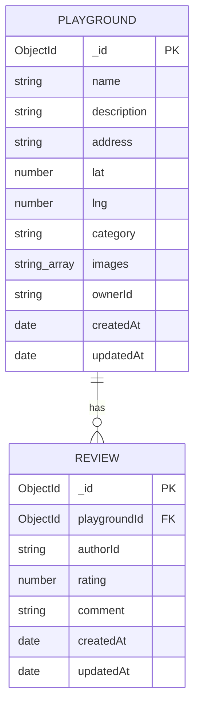

# SpielSpot Backend API Plan

Mini project planning document. The frontend reuses `frontend/` from `i-chieh-liu-88/SpielSpot-v2`; this document plans an entirely new `backend/`.

## Tech Stack

- Runtime: Node.js + Express
- Database: MongoDB Atlas + Mongoose
- Auth: Clerk (verifies JWTs sent from the frontend)

## ERD

> GitHub automatically renders the Mermaid syntax below as a diagram, so no separate image file is needed



Relationship: `Playground 1 --- N Review` (Review stores `playgroundId` as a foreign key)

## API Endpoints

| Method | Endpoint                     | Description                                  | Auth required?  |
| ------ | ---------------------------- | -------------------------------------------- | --------------- |
| GET    | /api/playgrounds             | Get all playgrounds (query filters optional) | No              |
| GET    | /api/playgrounds/:id         | Get a single playground + its reviews        | No              |
| POST   | /api/playgrounds             | Create a playground                          | Yes             |
| PATCH  | /api/playgrounds/:id         | Update (owner only)                          | Yes + ownership |
| DELETE | /api/playgrounds/:id         | Delete (owner only)                          | Yes + ownership |
| GET    | /api/playgrounds/:id/reviews | Get all reviews for a playground             | No              |
| POST   | /api/playgrounds/:id/reviews | Create a review                              | Yes             |
| DELETE | /api/reviews/:id             | Delete own review                            | Yes + ownership |

### Response Format

```json
// Success
{ "success": true, "data": { } }
// Failure
{ "success": false, "error": "message" }
```

## Security Checklist

- Clerk JWT authentication middleware (`verifyToken`)
- Ownership check (only the owner can edit/delete their own data)
- Input validation (`express-validator` or `zod`, to prevent dirty data / NoSQL injection)
- `helmet` (security headers)
- `cors` (whitelisting only the frontend origin)
- Rate limiting (`express-rate-limit`)
- Secrets stored in environment variables (`.env`, excluded from git)
- File upload validation for type/size (JPEG/PNG/WebP, 5MB limit)
- Centralized error handling middleware, no stack trace leaks

## Two-Day Execution Plan

### Day 1 (Today)

1. Set up the `backend/` folder structure (routes, controllers, models, middleware), install express, mongoose, dotenv, configure the MongoDB Atlas connection, and confirm the server runs
2. Write the Playground and Review Mongoose schemas, with ref relationships and basic validation
3. Write a `verifyToken` middleware to verify Clerk JWTs, complete Playground's GET/POST first, and test with Postman
4. Finalize this document's content and add it to the repo as `docs/api-plan.md`

### Day 2 (Tomorrow, submission deadline Tuesday 22.09.2026)

1. Add PATCH/DELETE for playgrounds and reviews, with ownership checks
2. Add helmet, cors, rate limiting, input validation, and centralized error handling middleware
3. Replace the fixture data in `frontend/src/services/playgrounds.ts` with real fetch calls, and run through a full create/edit/delete flow
4. Make sure the README covers installation/startup instructions, the ERD diagram, and a link to the API documentation, then git push and share the repo link with the instructor
